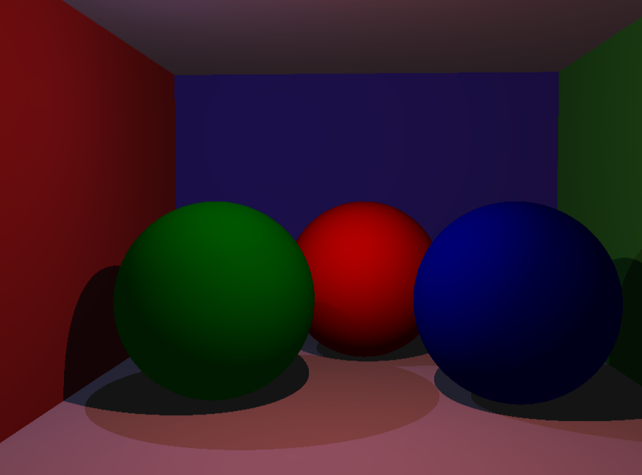
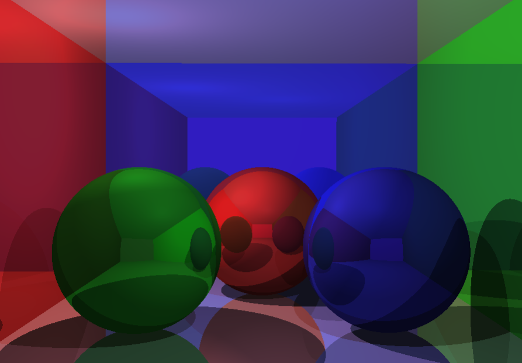
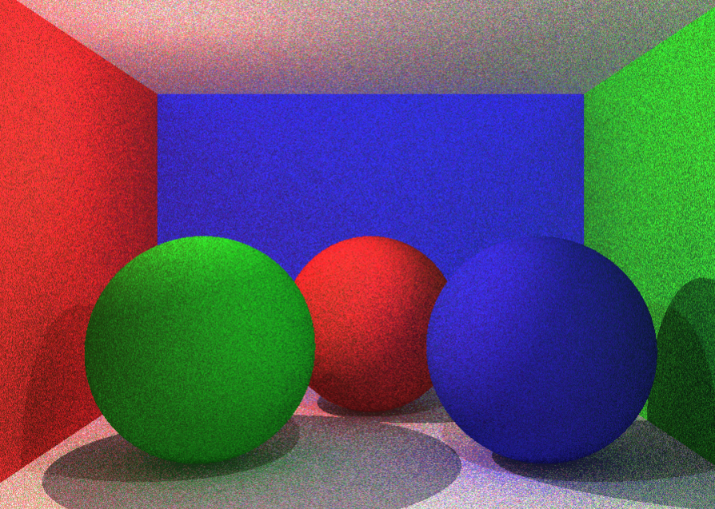
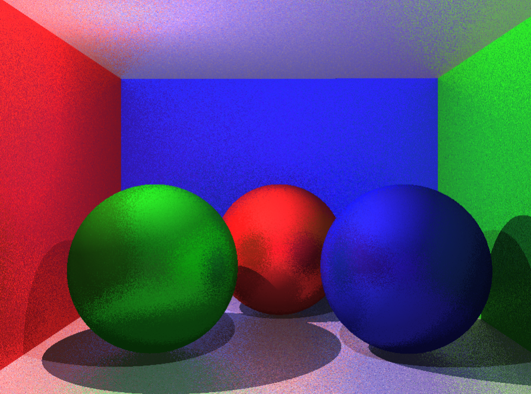

# raytracer-opengl
Raytracer OpenGL(GLSL) implementation

# Instructions for usage
- Open vscode
- Install glslCanvas from https://marketplace.visualstudio.com/items?itemName=circledev.glsl-canvas
(glslCanvas is an extension for vscode that visualizes shader in realtime as you code)
- Open the main.glsl file in vscode
- activate glslCanvas extention
- Enjoy

Much much faster than python implementation of raytracer (60 fps)
