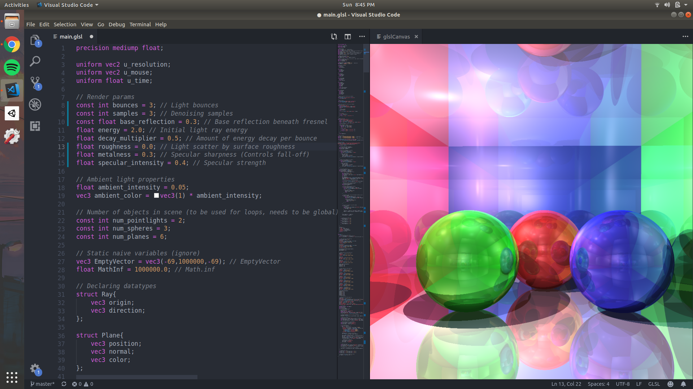
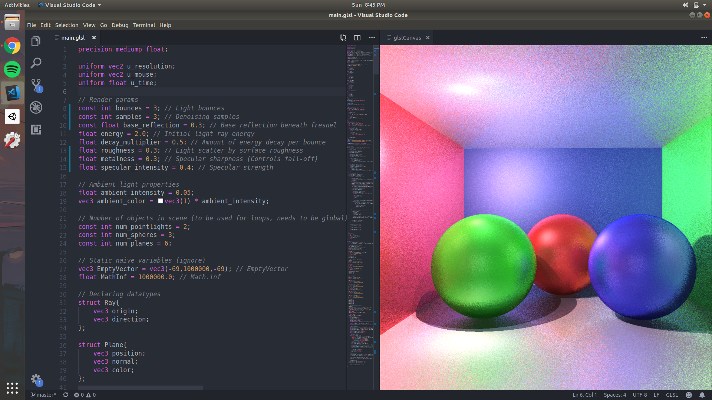
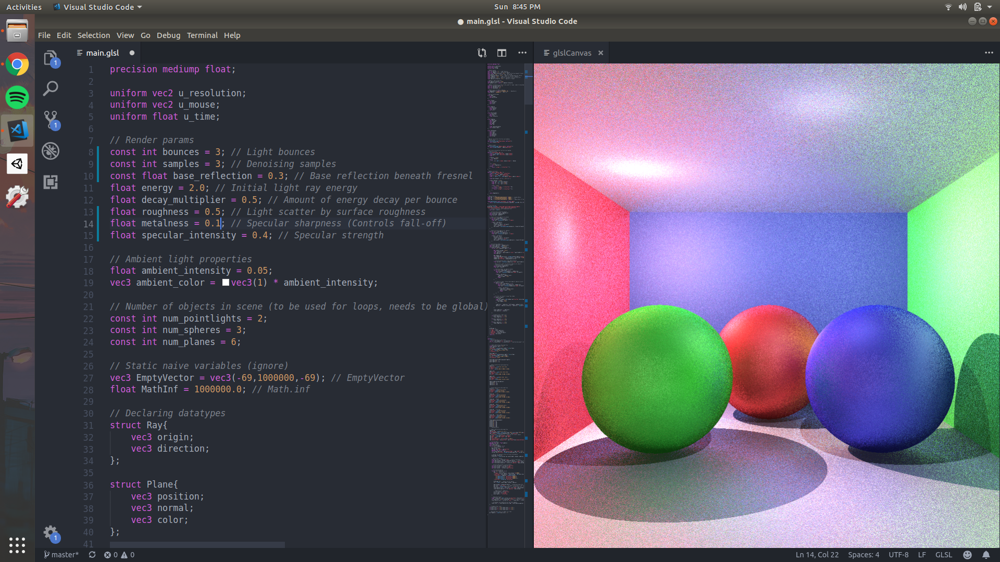
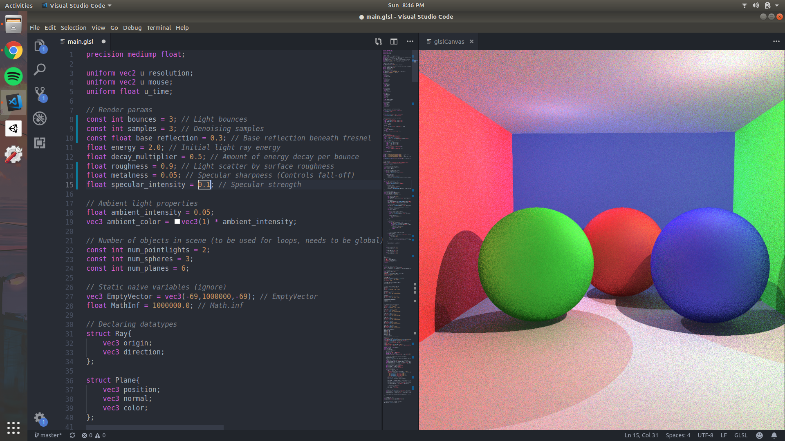

# raytracer-opengl
Raytracer OpenGL(GLSL) implementation

Roughness = 0.0

Roughness = 0.3

Roughness = 0.5

Roughness = 0.9

# Setup
- Open vscode
- Install glslCanvas from https://marketplace.visualstudio.com/items?itemName=circledev.glsl-canvas
(glslCanvas is an extension for vscode that visualizes shader in realtime as you code)
- Open the main.glsl file in vscode
- activate glslCanvas extention
- [ctrl]+[shift]+P then type 'Show glslCanvas' without(') and press enter
- The scene should start displaying

# Paramters
- Render parameters (Roughness, Bounces, Samples etc) start at line numbers 8
- Ambient light properties are at line numbers 16,17
- Lights definition and properties start at line 263
- Sphere objects definition and properties start at line 282
- Plane objects definition and properties start at line 304
- Camera definition and properties start at line 344

### Note
If you add or remove an object from the scene, be sure to adjust the static object count at line 20 to 22 accordingly

Much much faster than python implementation of raytracer (60 fps)
